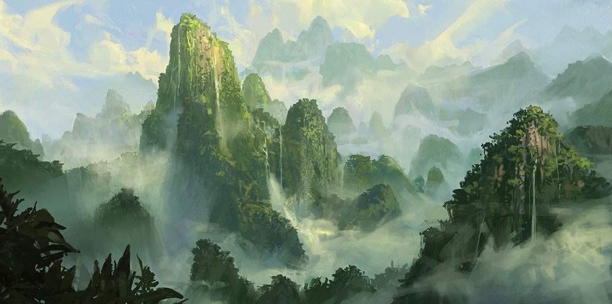

<!-- README.md is generated from README.Rmd. Please edit that file -->

# mtg

<!-- badges: start -->

[](https://travis-ci.org/tyluRp/mtg)
[](https://ci.appveyor.com/project/tyluRp/mtg)
[](https://codecov.io/gh/tyluRp/mtg?branch=master)
<!-- badges: end -->



Minimalistic client to access the [Magic: The Gathering
API](https://docs.magicthegathering.io/).

## Installation

You can install from [GitHub](https://github.com/) with:

``` r
# install.packages("devtools")
devtools::install_github("tyluRp/mtg")
```

## Example

Use `mtg` to access all available endpoints:

``` r
library(mtg)

mtg("formats")
#> ✔ Request: https://api.magicthegathering.io/v1/formats
#> ✔ Status: 200
#> ✔ Content-Type: application/json; charset=utf-8
#> $formats
#>       [,1]       
#>  [1,] "1v1"      
#>  [2,] "Brawl"    
#>  [3,] "Commander"
#>  [4,] "Duel"     
#>  [5,] "Frontier" 
#>  [6,] "Future"   
#>  [7,] "Legacy"   
#>  [8,] "Modern"   
#>  [9,] "Pauper"   
#> [10,] "Penny"    
#> [11,] "Standard" 
#> [12,] "Vintage"
```

Additionally, we can print the response as JSON thanks to the
[jsonlite](https://github.com/jeroen/jsonlite) package:

``` r
mtg("formats", json = TRUE)
#> ✔ Request: https://api.magicthegathering.io/v1/formats
#> ✔ Status: 200
#> ✔ Content-Type: application/json; charset=utf-8
#> {
#>   "formats": [
#>     ["1v1"],
#>     ["Brawl"],
#>     ["Commander"],
#>     ["Duel"],
#>     ["Frontier"],
#>     ["Future"],
#>     ["Legacy"],
#>     ["Modern"],
#>     ["Pauper"],
#>     ["Penny"],
#>     ["Standard"],
#>     ["Vintage"]
#>   ]
#> }
```

Response information can be suppressed with `quiet = TRUE`:

``` r
mtg("formats", quiet = TRUE)
#> $formats
#>       [,1]       
#>  [1,] "1v1"      
#>  [2,] "Brawl"    
#>  [3,] "Commander"
#>  [4,] "Duel"     
#>  [5,] "Frontier" 
#>  [6,] "Future"   
#>  [7,] "Legacy"   
#>  [8,] "Modern"   
#>  [9,] "Pauper"   
#> [10,] "Penny"    
#> [11,] "Standard" 
#> [12,] "Vintage"
```

## Acknowledgements

Artwork: *Unclaimed Territory* by [Dimitar
Marinski](https://www.artstation.com/dimarinski).
